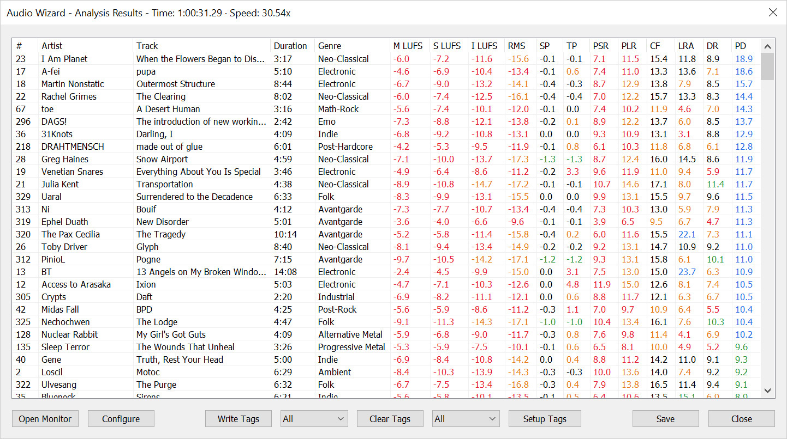
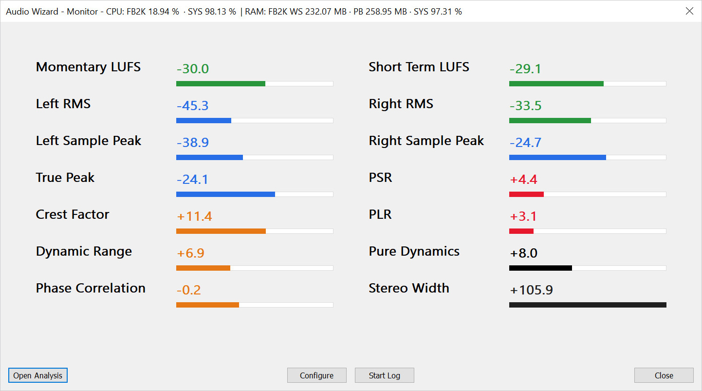

<!-- #region CROWN OF THE RUBY CHAPTER -->

<div align="center">
  <br>
  <picture>
    <source media="(prefers-color-scheme: dark)" srcset="assets/images/Audio-Wizard-Logo.svg">
    
  </picture>
  <br>
  <br>
</div>

<div align="center">
  <h1>
    <picture>
      <source media="(prefers-color-scheme: dark)" srcset="assets/images/Audio-Wizard-Title-Dark.svg">
      
    </picture>
  </h1>
</div>

<div align="center">
  <picture>
    <source media="(prefers-color-scheme: dark)" srcset="assets/images/Audio-Wizard-Subtitle-Dark.svg">
    
  </picture>
</div>

<!-- #endregion CROWN OF THE RUBY CHAPTER -->

<br>
<br>

<!-- #region CHRONICLES OF THE RUBY SANCTUM -->

*Sealed within the fiery **Rubynar Sanctum**, where sonic flames forge realms of unparalleled clarity,
the *Audio Wizard* (foo_audio_wizard) is a radiant chapter of *The Wizardium*’s grimoire.
Its runic seal, broken only by those who master the art of *Pure Dynamics*, grants audiophiles
and engineers dominion over sound, conjuring tools of precision for analysis and monitoring.*

<br>

<h3 align="center"><em><span title="The Wisdom Of The Divine Flame">⸺ Sapientia Flamma Divina ⸺</span></em></h3>
<div align="center"><a href="https://github.com/The-Wizardium">A Sacred Chapter Of The Wizardium</a></div>

<br>
<h2></h2>
<br>
<br>

## Arcana Of The Ruby Spell

- **Full-Track Analysis**:
  - Analyzes multiple selected tracks with metrics including:
    - Momentary LUFS
    - Short Term LUFS
    - Integrated LUFS
    - Root Mean Square (RMS)
    - Sample Peak (SP)
    - True Peak (TP)
    - Peak to Short-Term Loudness Ratio (PSR)
    - Peak to Long-Term Loudness Ratio (PLR)
    - Crest Factor (CF)
    - Loudness Range (LRA)
    - Dynamic Range (DR)
    - Pure Dynamics (PD)

     <br>

  - Full-Track Analysis Dialog:

    <details>
      <summary>Show Full-Track Analysis Dialog Screenshot (click to expand)</summary>
      <br>
        <picture>
          <source media="(prefers-color-scheme: dark)" srcset="assets/images/Audio-Wizard-Full-Track-Analysis-Dialog-Dark.jpg">
          
        </picture>
      <br>
    </details>

    - View detailed metrics for analyzed tracks.
    - Customize display settings.
    - Sort results by clicking column headers.
    - Display informative tooltips when hovering over column headers.
    - Play tracks by double-clicking.
    - Write or clear metadata tags.
    - Export results to a text file.

  - Generates waveform data for visualization.

<br>

- **Real-Time Monitoring**:
  - Monitors live audio with metrics such as:
    - Momentary LUFS (M LUFS)
    - Short-term LUFS (S LUFS)
    - RMS (Left, Right, Overall)
    - Sample Peaks (Left, Right)
    - True Peak (TP)
    - Peak to Short-Term Loudness Ratio (PSR)
    - Peak to Long-Term Loudness Ratio (PLR)
    - Crest Factor (CF)
    - Dynamic Range (DR)
    - Phase Correlation
    - Stereo Width
    - Pure Dynamics (PD)

    <br>

  - Real-Time Monitoring Dialog:

    <details>
      <summary>Show Real-Time Monitoring Dialog Screenshot (click to expand)</summary>
      <br>
        <picture>
          <source media="(prefers-color-scheme: dark)" srcset="assets/images/Audio-Wizard-Real-Time-Monitoring-Dialog-Dark.jpg">
          
        </picture>
      <br>
    </details>

    - View live audio metrics.
    - Customize display settings.
    - Enable meter bars with adjustable refresh rates.
    - Display informative tooltips when hovering over metric values or meter bars.
    - Toggle real-time logging.

<br>

- **Peakmeter Monitoring**: Drives a peakmeter using RMS and Sample Peak calculations.

- **Raw Audio Access**: Retrieves PCM audio samples in real-time.

- **API**: COM/ActiveX interface for scripting in foobar2000 via Spider Monkey Panel or JSplitter.

<br>

## Pure Dynamics: The Psychoacoustic Flame

<table>
  <tr>
    <td width="200">
      <picture>
        <source media="(prefers-color-scheme: dark)" srcset="assets/images/PD-Logo-Dark.svg">
        
      </picture>
    </td>
    <td>
      <strong>Pure Dynamics (PD)</strong>, also known as <em>Perceptual Dynamics</em>,
      is a groundbreaking metric that measures audio dynamic range as humans perceive it.
      Unlike traditional metrics like Dynamic Range (DR) or Loudness Range (LRA), PD uses psychoacoustic principles —
      such as Zwicker loudness, Fastl principles, and binaural perception — to deliver a single, perceptually accurate value.
      With a real-time latency of just 17ms at 60fps, PD is ideal for both offline analysis and live monitoring,
      making it a standout feature of Audio Wizard.
      <br>
      <br>
      <em>For a detailed explanation, see the <a href="assets/docs/PD.md">Pure Dynamics documentation</a>.</em>
      <br>
      <br>
    </td>
  </tr>
</table>

<br>

## Scholars Certification

*"These sacred sigils separate the scholars from the apprentices. Fail to decode them, and the Inner Sanctum remains barred."*

Validate Audio Wizard for Loudness Compliance with EBU R128 and ITU-R BS.2217-2, ensuring accurate metering for music production and streaming.
Extract with 7-Zip and analyze with Audio Wizard to verify results. The logs below show Audio Wizard’s analysis results for each signal set,
demonstrating compliance. Full logs for EBU Tech 3341 and ITU-R BS.2217-2 are included in the respective ZIPs.

- [**EBU_Reference_Signals.7z download**](https://drive.google.com/file/d/1QjBoNrtmT9kY_mtltXQHnemgUDL_sTNk/view?usp=drive_link):<br>
  4 WAVs for EBU R128 calibration (sines, pink noise).
  <details>
  <summary>EBU Reference Signals Log (click to expand)</summary>

  ```
  //////////////////////////////////////////////////////
  // * AUDIO WIZARD - ANALYSIS RESULTS - 07-08-2025 * //
  //////////////////////////////////////////////////////

  Processing Time: 0:10.35
  Processing Speed: 17.40x

  #    Track                                                              Duration    M LUFS    S LUFS    I LUFS      RMS
  -    ---------------------------------------------------------------    --------    ------    ------    ------    -----
  1    01_1kHz Sine -20 LUFS-16bit.wav                                    0:20         -20.0     -20.0     -20.0    -23.0
  2    02_1kHz Sine -26 LUFS-16bit.wav                                    0:20         -26.0     -26.0     -26.0    -29.0
  3    03_1kHz Sine -40 LUFS-16bit.wav                                    0:20         -40.0     -40.0     -40.0    -43.0
  4    04_EBU-reference_listening_signal_pinknoise_500Hz_2kHz_R128.wav    2:00         -22.4     -22.8     -23.0    -23.4
  ```
  </details>

- [**EBU_Tech_3341.7z download**](https://drive.google.com/file/d/1pLCo86tkdovZx9uCBv4HXEGgLd08rfam/view?usp=drive_link):<br>
  62 WAVs + PDF for loudness meter compliance (M/S/I LUFS, TP).
  <details>
  <summary>EBU Tech 3341 LUFS Log (click to expand)</summary>

  ```
  //////////////////////////////////////////////////////
  // * AUDIO WIZARD - ANALYSIS RESULTS - 07-08-2025 * //
  //////////////////////////////////////////////////////

  Processing Time: 0:36.07
  Processing Speed: 17.18x

  #     Track                                                       Duration    M LUFS    S LUFS    I LUFS      RMS
  --    --------------------------------------------------------    --------    ------    ------    ------    -----
  1     01_TC1_seq-3341-1-16bit_-23LUFS.wav                         0:20         -23.0     -23.0     -23.0    -26.0
  2     02_TC2_seq-3341-2-16bit_-33LUFS.wav                         0:20         -33.0     -33.0     -33.0    -36.0
  3     03_TC3_seq-3341-3-16bit-v02_-23LUFS.wav                     1:20         -23.0     -23.0     -23.0    -27.2
  4     04_TC4_seq-3341-4-16bit-v02_-23LUFS.wav                     1:40         -23.0     -23.0     -23.0    -28.2
  5     05_TC5_seq-3341-5-16bit-v02_-23LUFS.wav                     1:00         -20.0     -20.0     -23.0    -26.0
  6     06_TC6_seq-3341-6-5channels-16bit_-23LUFS.wav               0:20         -23.0     -23.0     -23.0    -30.4
  7     07_TC6_6ch_seq-3341-6-6channels-WAVEEX-16bit_-23LUFS.wav    0:19         -23.0     -23.0     -23.0    -31.2
  8     08_TC7_seq-3341-7_seq-3342-5-24bit_-23LUFS.wav              0:27         -19.6     -21.0     -23.0    -25.6
  9     09_TC8_seq-3341-2011-8_seq-3342-6-24bit-v02_-23LUFS.wav     4:06         -14.9     -18.0     -23.0    -26.7
  10    10_TC9_seq-3341-9-24bit_-23LUFS.wav                         0:15         -20.0     -23.0     -23.0    -26.0
  11    32_TC12_seq-3341-12-24bit_-23LUFS.wav                       0:10         -23.0     -22.7     -23.0    -26.0
  ```

  **Secret Wisdom**: Test cases 10 (11_TC10* to 30_TC10*) and 13 (33_TC13* to 52_TC13*) are excluded from this log
  as they are designated for file-based loudness meters only. Test cases 11 (31_TC11*) and 14 (53_TC14*) are also
  excluded as they are intended for live loudness meters only, per EBU Tech 3341 (2023), Table 1: Minimum requirements test signals.
  </details>
  <details>
  <summary>EBU Tech 3341 True Peak Log (click to expand)</summary>

  ```
  //////////////////////////////////////////////////////
  // * AUDIO WIZARD - ANALYSIS RESULTS - 07-08-2025 * //
  //////////////////////////////////////////////////////

  Processing Time: 0:01.37
  Processing Speed: 20.98x

  #    Track                                   Duration      SP      TP
  -    ------------------------------------    --------    ----    ----
  1    54_TC15_seq-3341-15-24bit_-6dBTP.wav    0:03        -6.0    -6.0
  2    55_TC16_seq-3341-16-24bit_-6dBTP.wav    0:03        -9.0    -6.0
  3    56_TC17_seq-3341-17-24bit_-6dBTP.wav    0:03        -7.2    -6.0
  4    57_TC18_seq-3341-18-24bit_-6dBTP.wav    0:03        -6.7    -6.0
  5    58_TC19_seq-3341-19-24bit_+3dBTP.wav    0:03         0.0     3.0
  6    59_TC20_seq-3341-20-24bit_0dBTP.wav     0:03        -0.1    -0.1
  7    60_TC21_seq-3341-21-24bit_0dBTP.wav     0:03        -0.5    -0.1
  8    61_TC22_seq-3341-22-24bit_0dBTP.wav     0:03        -2.5    -0.1
  9    62_TC23_seq-3341-23-24bit_0dBTP.wav     0:03        -0.5    -0.1
  ```
  </details>

- [**EBU_Tech_3342.7z download**](https://drive.google.com/file/d/1wvdKzdZI2uhmuKhiUB3PZjCbOm5gSy4U/view?usp=drive_link):<br>
  6 WAVs + PDF for LRA testing.
  <details>
  <summary>EBU Tech 3342 Log (click to expand)</summary>

  ```
  //////////////////////////////////////////////////////
  // * AUDIO WIZARD - ANALYSIS RESULTS - 07-08-2025 * //
  //////////////////////////////////////////////////////

  Processing Time: 0:32.24
  Processing Speed: 15.33x

  #    Track                                                    Duration     LRA
  -    -----------------------------------------------------    --------    ----
  1    01_TC1_seq-3342-1-16bit_LRA10.wav                        0:40        10.0
  2    02_TC2_seq-3342-2-16bit_LRA5.wav                         0:40         5.0
  3    03_TC3_seq-3342-3-16bit_LRA20.wav                        0:40        20.0
  4    04_TC4_seq-3342-4-16bit_LRA15.wav                        1:40        15.0
  5    05_TC5_seq-3342-5-24bit_LRA5.wav                        0:27         5.0
  6    06_TC6_seq-3341-2011-8_seq-3342-6-24bit-v02_LRA15.wav    4:06        15.0
  ```
  </details>

- [**ITU-R BS.2217-2.7z download**](https://drive.google.com/file/d/1gCT_slPeT6Epz-YCU6SOBHYbgCg9VQmR/view?usp=drive_link):<br>
  47 WAVs for ITU compliance, including LFE tracks (I LUFS = -70.0, as LFE is excluded).
  <details>
  <summary>ITU-R BS.2217-2 Log (click to expand)</summary>

  ```
  //////////////////////////////////////////////////////
  // * AUDIO WIZARD - ANALYSIS RESULTS - 07-08-2025 * //
  //////////////////////////////////////////////////////

  Processing Time: 1:44.69
  Processing Speed: 18.59x

  #     Track                                           Duration    M LUFS    S LUFS    I LUFS      RMS
  --    --------------------------------------------    --------    ------    ------    ------    -----
  1     01_1770-2_Comp_RelGateTest.wav                  0:04          -7.1     -10.4     -10.0    -14.7
  2     02_1770-2_Comp_AbsGateTest.wav                  0:04         -69.5     -72.4     -69.5    -76.7
  3     03_1770-2_Comp_24LKFS_25Hz_2ch.wav              0:29         -24.0     -24.0     -24.0    -15.9
  4     04_1770-2_Comp_24LKFS_100Hz_2ch.wav             0:29         -24.0     -24.0     -24.0    -25.2
  5     05_1770-2_Comp_24LKFS_500Hz_2ch.wav             0:29         -24.0     -24.0     -24.0    -26.4
  6     06_1770-2_Comp_24LKFS_1000Hz_2ch.wav            0:29         -24.0     -24.0     -24.0    -27.0
  7     07_1770-2_Comp_24LKFS_2000Hz_2ch.wav            0:29         -24.0     -24.0     -24.0    -29.4
  8     08_1770-2_Comp_24LKFS_10000Hz_2ch.wav           0:29         -24.0     -24.0     -24.0    -30.4
  9     09_1770-2_Comp_23LKFS_25Hz_2ch.wav              0:29         -23.0     -23.0     -23.0    -14.9
  10    10_1770-2_Comp_23LKFS_100Hz_2ch.wav             0:29         -23.0     -23.0     -23.0    -24.2
  11    11_1770-2_Comp_23LKFS_500Hz_2ch.wav             0:29         -23.0     -23.0     -23.0    -25.4
  12    12_1770-2_Comp_23LKFS_1000Hz_2ch.wav            0:29         -23.0     -23.0     -23.0    -26.0
  13    13_1770-2_Comp_23LKFS_2000Hz_2ch.wav            0:29         -23.0     -23.0     -23.0    -28.4
  14    14_1770-2_Comp_23LKFS_10000Hz_2ch.wav           0:29         -23.0     -23.0     -23.0    -29.4
  15    15_1770-2_Comp_18LKFS_FrequencySweep.wav        2:00         -17.9     -18.0     -18.0    -15.1
  16    16_1770-2_Comp_24LKFS_SummingTest.wav           0:29         -24.0     -24.0     -24.0    -25.7
  17    17_1770-2_Comp_23LKFS_SummingTest.wav           0:29         -23.0     -23.0     -23.0    -24.7
  18    18_1770-2_Comp_24LKFS_ChannelCheckLeft.wav      0:29         -24.0     -24.0     -24.0    -31.8
  19    19_1770-2_Comp_24LKFS_ChannelCheckRight.wav     0:29         -24.0     -24.0     -24.0    -31.8
  20    20_1770-2_Comp_24LKFS_ChannelCheckCentre.wav    0:29         -24.0     -24.0     -24.0    -31.8
  21    21_1770-2_Comp_24LKFS_ChannelCheckLFE.wav       0:29          -inf      -inf     -70.0    -30.0
  22    22_1770-2_Comp_24LKFS_ChannelCheckLs.wav        0:29         -24.0     -24.0     -24.0    -33.3
  23    23_1770-2_Comp_24LKFS_ChannelCheckRs.wav        0:29         -24.0     -24.0     -24.0    -33.3
  24    24_1770-2_Comp_23LKFS_ChannelCheckLeft.wav      0:29         -23.0     -23.0     -23.0    -30.8
  25    25_1770-2_Comp_23LKFS_ChannelCheckRight.wav     0:29         -23.0     -23.0     -23.0    -30.8
  26    26_1770-2_Comp_23LKFS_ChannelCheckCentre.wav    0:29         -23.0     -23.0     -23.0    -30.8
  27    27_1770-2_Comp_23LKFS_ChannelCheckLFE.wav       0:29          -inf      -inf     -70.0    -29.0
  28    28_1770-2_Comp_23LKFS_ChannelCheckLs.wav        0:29         -23.0     -23.0     -23.0    -32.3
  29    29_1770-2_Comp_23LKFS_ChannelCheckRs.wav        0:29         -23.0     -23.0     -23.0    -32.3
  30    30_1770-2_Conf_6ch_VinCntr-24LKFS.wav           1:23         -17.8     -19.2     -24.0    -32.4
  31    31_1770-2_Conf_6ch_VinL+R-24LKFS.wav            1:23         -17.8     -19.2     -24.0    -32.4
  32    32_1770-2_Conf_6ch_VinL-R-C-24LKFS.wav          1:23         -17.8     -19.1     -24.0    -32.8
  33    33_1770-2_Conf_Stereo_VinL+R-24LKFS.wav         1:23         -18.2     -19.6     -24.0    -27.7
  34    34_1770-2_Conf_Mono_Voice+Music-24LKFS.wav      1:23         -18.2     -19.9     -24.0    -24.5
  35    35_1770-2_Conf_6ch_VinCntr-23LKFS.wav           1:23         -16.8     -18.2     -23.0    -31.4
  36    36_1770-2_Conf_6ch_VinL+R-23LKFS.wav            1:23         -16.8     -18.2     -23.0    -31.4
  37    37_1770-2_Conf_6ch_VinL-R-C-23LKFS.wav          1:23         -16.8     -18.1     -23.0    -31.8
  38    38_1770-2_Conf_Stereo_VinL+R-23LKFS.wav         1:23         -17.2     -18.6     -23.0    -26.7
  39    39_1770-2_Conf_Mono_Voice+Music-23LKFS.wav      1:23         -17.2     -18.9     -23.0    -23.5
  40    40_1770Conf-24LKFS-8channel.wav                 0:29         -24.0     -24.0     -24.0    -26.9
  41    41_1770Conf-23LKFS-8channel.wav                 0:29         -23.0     -23.0     -23.0    -26.7
  42    42_1770Conf-24LKFS-10channel.wav                0:29         -24.0     -24.0     -24.0    -27.9
  43    43_1770Conf-23LKFS-10channel.wav                0:29         -23.0     -23.0     -23.0    -26.9
  44    44_1770Conf-24LKFS-12channel.wav                0:29         -24.0     -24.0     -24.0    -28.7
  45    45_1770Conf-23LKFS-12channel.wav                0:29         -23.0     -23.0     -23.0    -27.7
  46    46_1770Conf-24LKFS-24channel.wav                0:29         -24.0     -24.0     -24.0    -29.2
  47    47_1770Conf-23LKFS-24channel.wav                0:29         -23.0     -23.0     -23.0    -28.2
  ```

  **Secret Wisdom**: The LFE channel test signals (21_1770-2_Comp_24LKFS_ChannelCheckLFE.wav
  and 27_1770-2_Comp_23LKFS_ChannelCheckLFE.wav) are included in this log but report an Integrated LUFS value
  of -70.0, as the LFE channel is excluded from loudness measurements per ITU-R BS.2217-2.
  This aligns with EBU Tech 3341 (2023), section 2.10, which notes that the LFE channel is not included in BS.1770 measurements,
  and ITU-R BS.2217-2 (2016), which states that LFE channel readings depend on implementation but are not part of the standard measurement.
  </details>

<br>

## Gather The Relics

- **Conjure** [foobar2000](https://www.foobar2000.org) - The foundational altar
- **Summon** [Spider Monkey Panel](https://github.com/TheQwertiest/foo_spider_monkey_panel) or
  [JSplitter](https://foobar2000.ru/forum/viewtopic.php?t=6378) - For JavaScript communion

<br>

## Perform The Ritual

01. **Invoke** foobar2000's installation ceremony.
02. **Channel** this sacred chapter from its [GitHub sanctum](https://github.com/The-Wizardium/Audio-Wizard).
03. **Bind** the component to your foobar2000 essence.

<br>

## Cast The Spell

- **Full-Track Analysis**:
  01. Select one or more tracks in foobar2000.
  02. Right-click and navigate to `Audio Wizard` > `Open Analysis` in the context menu.
  03. View results, manage tags, or save analysis data in the dialog.

- **Real-Time Monitoring**:
  01. Select a track in foobar2000.
  02. Right-click and choose `Audio Wizard` > `Open Monitor` from the context menu.
  03. Monitor live metrics, adjust settings, or enable logging in the dialog.

<br>

## Enhance The Arcana

For detailed information on the JavaScript API, including usage examples and a complete reference of properties and methods,<br>
see the [API documentation](API.md).

<br>

## Secret Wisdom

Full-Track Analysis and Real-Time Monitoring Logs can be saved as `.txt` or `.csv` files.<br>
For optimal visual alignment when opening `.csv` files in LibreOffice or OpenOffice, use a monospace font such as Consolas.

<br>

## Join The Inner Circle

New Arcane Arts are ever welcome! Prove your mastery:
- **Forge Enhancements**: Submit pull requests to expand this chapter's magic.
- **Reveal Mystical Anomalies**: Open issues to report eldritch bugs.
- **Earn Your Sigil**: Notable contributors will be etched in the Hall of Honorable Scholars.

<br>

## Hall Of Honorable Scholars

- Peter Pawlowski for [foobar2000](https://www.foobar2000.org).
- Tsuda Kageyu for [MinHook](https://github.com/TsudaKageyu/minhook).

<br>

## Sacred Oaths

This holy spell be bound by the sacred oath of the GNU Affero General Public License v3.0 (AGPLv3).

<!-- #endregion CHRONICLES OF THE RUBY SANCTUM -->

<br>
<br>

<!-- #region SECRET INSCRIPTION OF THE ETERNAL BINDING -->

<div align="center">
  <h2>
    <picture>
      <source media="(prefers-color-scheme: dark)" srcset="assets/images/Audio-Wizard-Footer-Slogan-Dark.svg">
      
    </picture>
  </h2>
</div>

<div align="center">
  <a href="https://www.the-wizardium.org/index.html#ChroniclesOfTheSealedChapters">Prove Your Worth And Wield The Wizardium’s Sacred Spells</a>
</div>

<div align="center">
  <a href="#" onclick="window.scrollTo(0, 0);">
    <picture>
      <source media="(prefers-color-scheme: dark)" srcset="assets/images/Audio-Wizard-Footer-Rune-Dark.svg">
      
    </picture>
  <a>
</div>

<!-- #endregion SECRET INSCRIPTION OF THE ETERNAL BINDING -->
